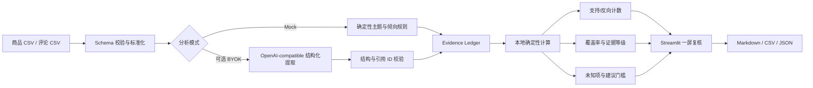

# Evidence-Backed Amazon VOC Copilot

一个面向跨境电商选品与产品定义的可解释 VOC（Voice of Customer）决策台。它不只总结评论，而是把每条痛点判断连接到**支持证据、反向证据、覆盖范围和未知项**，让运营、产品和供应链人员能够复核 AI 或规则给出的结论。

> 项目边界：本项目不是 Amazon 官方工具，不接入 Amazon 实时数据，也不绕过登录、验证码或网站访问限制。仓库内演示数据均为人工编写的合成数据，不能代表真实市场表现。

## 在线演示

[打开 Streamlit 公网 Demo](https://evidence-backed-amazon-voc-copilo-ciusxfofw77kvhpgccc3a9.streamlit.app/)

内置 Mock 演示无需 API Key，打开后即可复核 30 条合成评论的支持证据、反向证据和建议引用。公共部署不启用商品 URL 抓取，也不配置共享模型密钥；页面数据与结论仍只是合成样例和待复核推断。

## 为什么做这个项目

常见评论分析工具会输出“用户在抱怨佩戴不稳”之类的摘要，却很少回答：有多少条评论支持这一判断、是否存在相反体验、覆盖了多少个竞品，以及目前还缺什么信息。

本项目增加了一个 `Evidence Ledger`（证据账本）：

- 将洞察标记为 `fact`、`inference` 或 `unknown`；
- 同时展示支持评论与反向评论，不只挑选符合结论的内容；
- 所有计数、覆盖率和证据等级都由可检查的规则计算；
- 证据不足或冲突过高时，停止给出确定性建议；
- 导出包含原始评论引用的审计报告，便于团队复核。

`evidence_strength` 是透明的规则分级，不是统计置信度，也没有经过真实业务数据校准。

## 一屏使用流程

```text
载入 30 条合成评论或上传 CSV
              ↓
查看痛点洞察（事实 / 推断 / 未知）
              ↓
展开证据，核对支持评论与反向评论
              ↓
查看证据强度、覆盖率、涉及商品数和未知项
              ↓
仅在证据门槛通过时查看建议
              ↓
导出 Markdown / CSV / JSON 审计结果
```

修改、删除或替换源评论后，分析会从当前输入重新计算，不复用旧结论。

## 当前能力

### VOC 证据账本

- 校验并标准化评论 CSV，包括空评论、重复 `review_id`、非法评分和日期问题；
- 在 Mock 模式下以确定性关键词规则识别佩戴舒适度、耐用性和电池/充电主题；
- 聚合支持与反向证据，计算评论数、商品数和主题覆盖率；
- 公开低、中、高及证据不足的分级规则；
- 当反向证据不少于支持证据，或样本未达到门槛时，将洞察降级为 `unknown`；
- 每条可执行建议必须带有源评论 ID；无证据时不生成确定性建议；
- 提供带原文引用的 Markdown、逐证据行 CSV 和完整 JSON 导出。

### 可选 BYOK 结构化提取

项目包含 OpenAI-compatible 的实验性结构化提取接口。模型只负责提出主题标签、洞察类型和评论引用；引用 ID 会在本地校验，证据计数、覆盖率、强度分级、未知项和建议门槛全部由确定性代码重算。模型返回的计数、强度或建议文案不会进入结果。通过校验的 AI 证据账本会单独展示，只有通过相同证据门槛时才生成带引用的确定性建议，且不会覆盖 Mock 证据账本。

- API Key 只保留在当前 Streamlit 会话中，并在用户主动运行抽取时随请求发送；应用不会主动将其写入仓库、文件或日志；
- 默认只允许 `https://api.openai.com/v1`；部署者可通过 `VOC_LLM_ALLOWED_HOSTS` 显式增加可信的公网 HTTPS 兼容主机。内网地址、未获准主机、非公网解析结果及接口重定向会被拒绝；
- 发送给所选服务商的是当前分析所需的评论字段，请勿上传敏感或无授权数据；
- 第三方端点仍可能按其自身政策记录请求，使用前应核对服务商条款；
- 模型返回内容必须通过 JSON 结构、洞察类型和引用存在性校验，否则拒绝采用。
- 已校验的 AI 结果按当前评论签名保留在本次会话中；评论变更后自动失效，并可单独导出 Markdown、CSV 和 JSON。

没有 API Key 也可以完整运行内置 Mock 演示。

### 原市场调研能力

仓库同时保留上游仪表盘的表格导入、字段映射、利润估算、公开供应商页面采集、规格矩阵、缺口分析、需求草案、供应商对比和项目工作台等能力。利润与机会分数均由显式公式计算，但它们仍是早期筛选指标，不等于真实销量或最终立项结论。

## 数据格式

仓库包含商品与评论两类 CSV。商品 CSV 供原市场分析流程使用，评论 CSV 是 VOC 证据账本的直接输入；演示文件用 `product_id` / `asin` 对应两者，但当前 VOC 页面只要求上传评论 CSV。可直接参考 [`data/sample_products_voc.csv`](data/sample_products_voc.csv) 和 [`data/sample_reviews.csv`](data/sample_reviews.csv)。

### 1. 商品 CSV

| 字段 | 类型 | 说明 |
| --- | --- | --- |
| `asin` | string | 商品标识；在演示中也作为评论表的 `product_id` |
| `title` | string | 商品标题 |
| `brand` | string | 品牌 |
| `price` | number | 售价，演示数据按美元理解 |
| `rating` | number | 商品汇总评分，范围 0–5 |
| `reviews` | integer | 商品汇总评论数 |
| `monthly_sales` | number | 外部提供的月销量估计；项目不会自行抓取或验证 |
| `category` | string | 商品类目 |

示例：

```csv
asin,title,brand,price,rating,reviews,monthly_sales,category
B0FIT001,MoveBeat Air Sport Earbuds,MoveBeat,39.99,4.3,1842,960,Sports Headphones
```

### 2. 评论 CSV

| 字段 | 类型 | 校验规则 |
| --- | --- | --- |
| `review_id` | string | 必填且应唯一；重复时只保留第一条 |
| `product_id` | string | 必填；用于汇总涉及的商品数 |
| `rating` | number | 必填，范围 1–5 |
| `review_text` | string | 必填；空文本会被过滤 |
| `review_date` | date | 可为空；推荐 ISO `YYYY-MM-DD`，无法解析时记为未知并产生警告 |
| `source_type` | string | 数据来源标记；为空时标准化为 `unknown` |

示例：

```csv
review_id,product_id,rating,review_text,review_date,source_type
R001,B0FIT001,2,"The earbuds work loose when I run.",2026-05-03,demo_synthetic
```

不要把商品表中的 `reviews`（评论总数）与评论表中的单条 `review_id` 混为一谈。当前 VOC 证据覆盖率以**实际上传并通过校验的评论样本**为分母，而不是商品页显示的全部评论数。

## 计算边界

| 输出 | 计算方式 | 可以说明什么 | 不能说明什么 |
| --- | --- | --- | --- |
| 支持/反向计数 | 对有效评论 ID 去重聚合 | 当前样本中两类证据的数量 | 全量消费者的真实比例 |
| 主题覆盖率 | 该主题证据评论数 / 有效评论总数 | 当前样本对该主题的覆盖 | 统计显著性或因果关系 |
| 商品数 | 证据关联的不同 `product_id` 数 | 证据是否跨多个商品 | 整个类目的代表性 |
| 证据强度 | 公开阈值规则 | 是否达到应用内决策门槛 | 模型准确率或概率置信度 |
| 机会分数 | 销量、评论壁垒、评分缺口、品牌集中度和价格空间的加权规则 | 相同输入集内的早期排序 | 真实需求或未来销量 |
| 利润估算 | 售价减产品、物流、平台、广告和退货假设 | 假设变化下的筛选结果 | 实际利润或会计结果 |

证据等级的当前规则如下；界面中的“查看计算规则”和 JSON 导出也会带上同一份配置：

| 等级 | 确定性门槛 |
| --- | --- |
| `insufficient` | 支持评论少于 2 条，或主题覆盖率低于 10% |
| `low` | 通过最低门槛，但未达到中等或较高门槛 |
| `medium` | 支持评论至少 3 条、至少涉及 2 个商品、覆盖率至少 15%，且反向评论少于支持评论 |
| `high` | 支持评论至少 5 条、至少涉及 3 个商品、覆盖率至少 25%，且反向证据占全部该主题证据不超过 25% |

无论分级结果如何，只要反向评论不少于支持评论，洞察都会强制标记为 `unknown`。主题覆盖率为该主题支持与反向评论的唯一 ID 数除以全部有效评论数；全局覆盖率则统计至少命中一个已识别主题的唯一评论 ID。

Mock 分析目前只覆盖有限的英文主题和关键词。可选 LLM 输出也属于待复核的推断；无论哪种模式，都不能替代市场调研、合规检查、样品测试或供应商核验。

## 本地运行

建议使用 Python 3.12（仓库 CI 使用的版本）。

macOS / Linux：

```bash
python3 -m venv .venv
source .venv/bin/activate
python -m pip install -r requirements.txt
python -m streamlit run app.py
```

Windows PowerShell：

```powershell
py -m venv .venv
.venv\Scripts\Activate.ps1
python -m pip install -r requirements.txt
python -m streamlit run app.py
```

浏览器打开 Streamlit 输出的本地地址，在侧栏选择“VOC 证据账本”。首次体验建议直接使用内置合成数据，无需配置 API Key。

公开商品 URL 抓取属于上游遗留能力，默认不显示，以避免公共服务器成为任意网络请求入口。只在可信本地环境需要该功能时，可先设置 `ENABLE_PUBLIC_URL_IMPORT=1`；抓取器仍会拒绝非公网地址并逐跳校验重定向。

## 导出内容

- **Markdown 审计报告**：摘要、证据规则、每条洞察、支持原文、反向原文、建议及引用；
- **CSV 证据明细**：每行一个洞察与评论引用关系，包含证据角色和源评论字段；
- **JSON 完整结果**：适合程序继续处理，包含摘要、标准化评论、洞察、建议、校验问题和规则配置；
- **Excel / Workspace JSON**：来自原市场调研工作流，用于标准化商品、利润假设、规格和项目工作台交换。

所有导出都只反映本次输入和当前规则，不应被描述为已验证的 Amazon 市场事实。

## 架构



主要模块：

- `src/voc/models.py`：`ReviewRecord`、`Insight`、`Recommendation` 等稳定数据对象；
- `src/voc/validation.py`：评论 CSV 读取、标准化和逐行问题报告；
- `src/voc/analysis.py`：Mock 主题识别、冲突处理、证据等级和建议门槛；
- `src/voc/export.py`：可审计的 Markdown、CSV 和 JSON 导出；
- `src/voc_llm.py`：可选 OpenAI-compatible 请求、不可信输出校验与确定性 `AnalysisResult` 适配；
- `app.py`：Streamlit 入口，整合 VOC 与原市场调研功能。

## 测试与小型评测集

运行全部自动化测试：

```bash
python -m pytest -q
```

测试覆盖评论空值、重复 ID、非法评分、反向证据、低覆盖率、无证据建议、源评论变更后的重新计算、导出引用、非法 LLM JSON、未知引用和 API 错误脱敏等场景。

[`data/evaluation/review_annotations.csv`](data/evaluation/review_annotations.csv) 为 30 条合成耳机评论提供人工编写的期望主题与支持/反向标签。它只用于发现功能回归，**不是**模型准确率、统计校准结果或真实 Amazon 评论上的性能证明；详见 [`docs/evaluation.md`](docs/evaluation.md)。

## 三分钟面试演示

**0:00–0:30｜业务问题** 说明传统 VOC 摘要缺少可追溯依据，本项目要回答“为什么相信这条结论”。

**0:30–1:00｜输入与边界** 载入内置 30 条合成评论，指出 `demo_synthetic` 来源标记，并说明没有实时抓取 Amazon。

**1:00–1:50｜证据账本** 打开一条痛点，展示支持评论、反向评论、涉及商品数、覆盖率和未知项；强调证据等级是规则分级，不是置信概率。

**1:50–2:20｜保护机制** 展示证据冲突或不足时的 `unknown` 状态，以及系统不生成无引用建议的行为。

**2:20–2:45｜可复核性** 导出 Markdown 或 CSV，沿评论 ID 回到原文；修改一条源评论并重新分析，观察计数与结论同步变化。

**2:45–3:00｜技术取舍** 说明 LLM 只负责可选的结构化提取，关键数字由确定性代码计算，从而降低幻觉进入业务决策的风险。

## 简历表述（完成并验证后使用）

> 独立开发 Evidence-Backed Amazon VOC Copilot，使用 Python 与 Streamlit 构建评论证据账本，同时呈现支持与反向评论，并以确定性规则计算覆盖率和证据等级；实现证据不足保护、CSV/Markdown/JSON 审计导出、自动化测试，以及带引用校验的可选 OpenAI-compatible 结构化提取。

不要在简历中声称“接入 Amazon 实时数据”“显著提升销售额”或“达到生产级模型准确率”，除非之后取得合法数据源并完成可复现验证。

## 局限与合规

- 内置商品与评论均为合成演示数据，名称、指标和文本不对应真实商品；
- Mock 规则目前面向有限的英文评论主题，对隐喻、多语言和复杂语境覆盖不足；
- 小样本、抽样偏差、刷评、评论时间分布和商品版本差异都会影响结论；
- 项目不验证评论真实性，也不验证第三方销量、费用或供应商声明；
- 可选 BYOK 会把所选评论发送至用户配置的模型服务商，数据使用责任由操作者承担；
- 服务器端产品页面抓取只允许公网 HTTP/HTTPS 地址，并逐跳校验重定向；这降低了内网访问风险，但不等于替代部署平台的出口网络策略与限流；
- 输出用于研究与初筛，最终选品仍需结合合规、成本、广告、退货、供应链和实物测试。

## 上游项目与许可证

本项目基于 [`kirrrto/amazon-market-research-dashboard`](https://github.com/kirrrto/amazon-market-research-dashboard) 扩展，保留其 Streamlit 市场调研、数据导入、利润估算、规格分析和项目工作台基础，并新增 Evidence-Backed VOC 工作流。感谢上游作者与贡献者。

上游项目采用 MIT License。本仓库保留根目录 [`LICENSE`](LICENSE) 中的 MIT 许可文本；使用、修改或再分发时应继续保留该版权与许可声明。本说明不改变许可证原文。

原市场调研功能的详细文档仍可参考：

- [English documentation](docs/README.en.md)
- [简体中文文档](docs/README.zh-CN.md)
- [表格导入](docs/import-workflow.md)
- [公开产品页面连接器](docs/product-page-connector.md)
- [项目工作台](docs/project-workspace.md)
