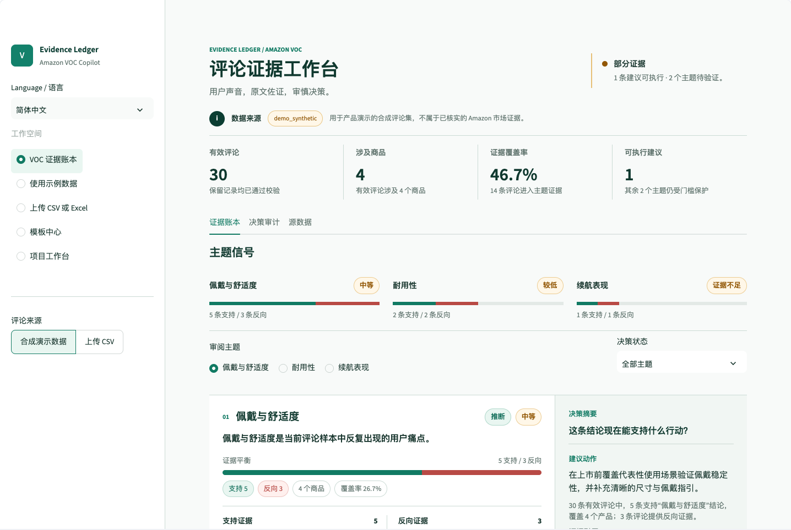
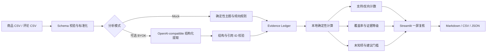

# Evidence-Backed Amazon VOC Copilot

> AI 工具辅助构建的用户洞察与证据工作台。面向跨境电商选品与产品定义，让每条结论都能回到评论原文，同时看见支持证据、反向证据和未知项。

[](https://github.com/xuueeer/evidence-backed-amazon-voc-copilot/actions/workflows/tests.yml)
[](https://www.python.org/)
[](https://streamlit.io/)
[](tests)
[](LICENSE)

[**打开在线作品**](https://evidence-backed-amazon-voc-copilo-ciusxfofw77kvhpgccc3a9.streamlit.app/?embed=true) · [**新版功能**](#新版工作台) · [**本地运行**](#本地运行) · [**原市场调研英文文档**](docs/README.en.md)



新版实机截图。公开演示无需 API Key；截图中的评论与指标来自合成样例，不代表真实市场结论。

## 新版工作台

2026-10-06 发布的新版保留原作品网址，重点改善证据阅读、检索与复核：

- **统一工作空间**：VOC 证据账本、示例调研、CSV/Excel 上传、模板中心、项目工作台共用白色侧栏与墨绿色品牌。
- **主题证据概览**：并列比较佩戴舒适度、耐用性、续航的支持与反向评论数量；条形采用共同计数尺度，不表示概率或模型置信度。
- **主题与状态筛选**：按审阅主题及“全部主题 / 可执行 / 待验证”切换；筛选只改变展示，不修改证据计数与建议门槛。
- **原文对照阅读**：支持与反向评论并排展示，长列表可展开，原始引用完整保留；未知项与分析假设可复核。
- **搜索与导出**：按评论编号、商品编号或原文检索，结合商品筛选导出对应 CSV；无匹配结果时禁用导出。
- **响应式与可读性**：完成 375、768、1024、1440、1920px 宽度检查；提供键盘焦点、触控控件及减少动画支持。

已交付 **1 套证据复核工作流、5 种输入与工作模式、3 类审计导出**；截至 2026-10-07，本地全量测试为 **287 项通过**。这些是产品与工程验收结果，不是业务效率、销售增长或全站无障碍认证。

## 30 秒看懂项目

| 普通评论总结 | 本项目的 Evidence Ledger |
| --- | --- |
| 输出一段“用户抱怨什么” | 每条结论引用可复核的 `review_id` 和原文 |
| 只展示支持观点的文本 | 并列支持与反向证据，显示冲突 |
| 模型同时生成文字和数字 | LLM 只做可选结构化提取；计数、覆盖率和门槛由确定性代码计算 |
| 即使数据不足也给出建议 | 低覆盖或冲突过高时标记 `unknown`，停止确定性建议 |
| 结果难以留档复查 | 导出带原文引用的 Markdown / CSV / JSON 审计记录 |

**演示路径：** `载入样例或上传评论 → 比较主题信号 → 筛选审阅主题 → 对照支持与反向原文 → 检查未知项和决策门槛 → 导出审计记录`

> **数据边界：** 内置 30 条评论和 4 个商品均为人工编写的合成数据。它们用于演示证据工作流，不代表真实 Amazon 市场、模型准确率或业务提升。本项目不是 Amazon 官方工具，不接入 Amazon 实时数据，也不绕过登录或网站访问限制。

## 在线演示

新版已部署到 [Streamlit 在线作品](https://evidence-backed-amazon-voc-copilo-ciusxfofw77kvhpgccc3a9.streamlit.app/?embed=true)。发布后已在无账号浏览器中验证现有 `?embed=true` 入口、主题切换、原文搜索及手机页面。内置 Mock 分析无需 API Key，不调用大模型；使用可选 BYOK 抽取时才会向所选模型服务商发送评论数据。

公共部署不启用商品 URL 抓取，也不配置共享模型密钥。

## 为什么做这个项目

常见评论分析工具会输出“用户在抱怨佩戴不稳”之类的摘要，却很少回答：有多少条评论支持这一判断、是否存在相反体验、覆盖了多少个竞品，以及目前还缺什么信息。

本项目增加了一个 `Evidence Ledger`（证据账本）：

- 将洞察标记为 `fact`、`inference` 或 `unknown`；
- 同时展示支持评论与反向评论，不只挑选符合结论的内容；
- 所有计数、覆盖率和证据等级都由可检查的规则计算；
- 证据不足或冲突过高时，停止给出确定性建议；
- 导出包含原始评论引用的审计报告，便于团队复核。

`evidence_strength` 是透明的规则分级，不是统计置信度，也没有经过真实业务数据校准。

## AI 工具协作路径

本作品侧重探索非技术背景下的需求表达、AI 工具协作与产品迭代。创作者使用自然语言提出目标和验收标准，根据截图与实际操作反馈调整需求；ChatGPT、Codex 等 AI 工具协助完成流程梳理、代码生成、排错、测试及部署验证。

1. **需求转流程**：明确“评论导入—主题分析—证据复核—建议与导出”的操作路径，先形成可操作原型。
2. **反馈驱动迭代**：基于实机截图与体验完成四轮结构、响应式、操作检查和问题修正。
3. **验证并上线**：检查上传、筛选、下载、语言切换和不同屏幕尺寸，再发布并复验在线版本。

构建过程中使用 AI 工具，与应用运行时是否调用大模型是两件事。个人贡献重点是需求组织、结果复核与产品迭代，不将 AI 生成代码或测试表述为独立手写开发；目前也没有真实业务中的效率提升或销售效果数据。

## 一屏使用流程

```text
载入 30 条合成评论或上传 CSV
              ↓
比较主题信号，筛选主题与决策状态
              ↓
查看洞察（事实 / 推断 / 未知），对照支持与反向原文
              ↓
查看证据强度、覆盖率、涉及商品数和未知项
              ↓
仅在证据门槛通过时查看建议
              ↓
导出 Markdown / CSV / JSON 审计结果，或检索源数据并导出筛选 CSV
```

修改、删除或替换源评论后，分析会从当前输入重新计算，不复用旧结论。

## 当前能力

### VOC 证据账本

- 校验并标准化评论 CSV，包括空评论、重复 `review_id`、非法评分和日期问题；
- 在 Mock 模式下以确定性关键词规则识别佩戴舒适度、耐用性和电池/充电主题；
- 聚合支持与反向证据，计算评论数、商品数和主题覆盖率；
- 通过共享计数尺度的主题图、主题选择与决策状态筛选定位需要审阅的洞察；
- 对照完整的支持与反向评论，按需展开长列表并查看分析假设；
- 在源数据页搜索评论编号、商品编号与原文，并按商品筛选；
- 公开低、中、高及证据不足的分级规则；
- 当反向证据不少于支持证据，或样本未达到门槛时，将洞察降级为 `unknown`；
- 每条可执行建议必须带有源评论 ID；无证据时不生成确定性建议；
- 提供带原文引用的 Markdown、逐证据行 CSV 和完整 JSON 导出，以及单独的筛选评论 CSV。

### 可选 BYOK 结构化提取

项目包含 OpenAI-compatible 的实验性结构化提取接口。模型只负责提出主题标签、洞察类型和评论引用；引用 ID 会在本地校验，证据计数、覆盖率、强度分级、未知项和建议门槛全部由确定性代码重算。模型返回的计数、强度或建议文案不会进入结果。通过校验的 AI 证据账本会单独展示，只有通过相同证据门槛时才生成带引用的确定性建议，且不会覆盖 Mock 证据账本。

- API Key 只保留在当前 Streamlit 会话中，并在用户主动运行抽取时随请求发送；应用不会主动将其写入仓库、文件或日志；
- 默认只允许 `https://api.openai.com/v1`；部署者可通过 `VOC_LLM_ALLOWED_HOSTS` 显式增加可信的公网 HTTPS 兼容主机。内网地址、未获准主机、非公网解析结果及接口重定向会被拒绝；
- 发送给所选服务商的是当前分析所需的评论字段，请勿上传敏感或无授权数据；
- 第三方端点仍可能按其自身政策记录请求，使用前应核对服务商条款；
- 模型返回内容必须通过 JSON 结构、洞察类型和引用存在性校验，否则拒绝采用。
- 已校验的 AI 结果按当前评论签名保留在本次会话中；评论变更后自动失效，并可单独导出 Markdown、CSV 和 JSON。

没有 API Key 也可以完整运行内置 Mock 演示。

### 原市场调研能力

仓库同时保留上游仪表盘的表格导入、字段映射、利润估算、公开供应商页面采集、规格矩阵、缺口分析、需求草案、供应商对比和项目工作台等能力。利润与机会分数均由显式公式计算，但它们仍是早期筛选指标，不等于真实销量或最终立项结论。

## 数据格式

仓库包含商品与评论两类 CSV。商品 CSV 供原市场分析流程使用，评论 CSV 是 VOC 证据账本的直接输入；演示文件用 `product_id` / `asin` 对应两者，但当前 VOC 页面只要求上传评论 CSV。可直接参考 [`data/sample_products_voc.csv`](data/sample_products_voc.csv) 和 [`data/sample_reviews.csv`](data/sample_reviews.csv)。

### 1. 商品 CSV

| 字段 | 类型 | 说明 |
| --- | --- | --- |
| `asin` | string | 商品标识；在演示中也作为评论表的 `product_id` |
| `title` | string | 商品标题 |
| `brand` | string | 品牌 |
| `price` | number | 售价，演示数据按美元理解 |
| `rating` | number | 商品汇总评分，范围 0–5 |
| `reviews` | integer | 商品汇总评论数 |
| `monthly_sales` | number | 外部提供的月销量估计；项目不会自行抓取或验证 |
| `category` | string | 商品类目 |

示例：

```csv
asin,title,brand,price,rating,reviews,monthly_sales,category
B0FIT001,MoveBeat Air Sport Earbuds,MoveBeat,39.99,4.3,1842,960,Sports Headphones
```

### 2. 评论 CSV

| 字段 | 类型 | 校验规则 |
| --- | --- | --- |
| `review_id` | string | 必填且应唯一；重复时只保留第一条 |
| `product_id` | string | 必填；用于汇总涉及的商品数 |
| `rating` | number | 必填，范围 1–5 |
| `review_text` | string | 必填；空文本会被过滤 |
| `review_date` | date | 可为空；推荐 ISO `YYYY-MM-DD`，无法解析时记为未知并产生警告 |
| `source_type` | string | 数据来源标记；为空时标准化为 `unknown` |

示例：

```csv
review_id,product_id,rating,review_text,review_date,source_type
R001,B0FIT001,2,"The earbuds work loose when I run.",2026-05-03,demo_synthetic
```

不要把商品表中的 `reviews`（评论总数）与评论表中的单条 `review_id` 混为一谈。当前 VOC 证据覆盖率以**实际上传并通过校验的评论样本**为分母，而不是商品页显示的全部评论数。

## 计算边界

| 输出 | 计算方式 | 可以说明什么 | 不能说明什么 |
| --- | --- | --- | --- |
| 支持/反向计数 | 对有效评论 ID 去重聚合 | 当前样本中两类证据的数量 | 全量消费者的真实比例 |
| 主题覆盖率 | 该主题证据评论数 / 有效评论总数 | 当前样本对该主题的覆盖 | 统计显著性或因果关系 |
| 商品数 | 证据关联的不同 `product_id` 数 | 证据是否跨多个商品 | 整个类目的代表性 |
| 证据强度 | 公开阈值规则 | 是否达到应用内决策门槛 | 模型准确率或概率置信度 |
| 机会分数 | 销量、评论壁垒、评分缺口、品牌集中度和价格空间的加权规则 | 相同输入集内的早期排序 | 真实需求或未来销量 |
| 利润估算 | 售价减产品、物流、平台、广告和退货假设 | 假设变化下的筛选结果 | 实际利润或会计结果 |

证据等级的当前规则如下；界面中的“查看证据规则”和 JSON 导出也会带上同一份配置：

| 等级 | 确定性门槛 |
| --- | --- |
| `insufficient` | 支持评论少于 2 条，或主题覆盖率低于 10% |
| `low` | 通过最低门槛，但未达到中等或较高门槛 |
| `medium` | 支持评论至少 3 条、至少涉及 2 个商品、覆盖率至少 15%，且反向评论少于支持评论 |
| `high` | 支持评论至少 5 条、至少涉及 3 个商品、覆盖率至少 25%，且反向证据占全部该主题证据不超过 25% |

无论分级结果如何，只要反向评论不少于支持评论，洞察都会强制标记为 `unknown`。主题覆盖率为该主题支持与反向评论的唯一 ID 数除以全部有效评论数；全局覆盖率则统计至少命中一个已识别主题的唯一评论 ID。

Mock 分析目前只覆盖有限的英文主题和关键词。可选 LLM 输出也属于待复核的推断；无论哪种模式，都不能替代市场调研、合规检查、样品测试或供应商核验。

## 本地运行

建议使用 Python 3.12（仓库 CI 使用的版本）。

macOS / Linux：

```bash
python3 -m venv .venv
source .venv/bin/activate
python -m pip install -r requirements.txt
python -m streamlit run app.py
```

Windows PowerShell：

```powershell
py -m venv .venv
.venv\Scripts\Activate.ps1
python -m pip install -r requirements.txt
python -m streamlit run app.py
```

浏览器打开 Streamlit 输出的本地地址，在侧栏选择“VOC 证据账本”。首次体验建议直接使用内置合成数据，无需配置 API Key。

公开商品 URL 抓取属于上游遗留能力，默认不显示，以避免公共服务器成为任意网络请求入口。只在可信本地环境需要该功能时，可先设置 `ENABLE_PUBLIC_URL_IMPORT=1`；抓取器仍会拒绝非公网地址并逐跳校验重定向。

## 导出内容

- **Markdown 审计报告**：摘要、证据规则、每条洞察、支持原文、反向原文、建议及引用；
- **CSV 证据明细**：每行一个洞察与评论引用关系，包含证据角色和源评论字段；
- **JSON 完整结果**：适合程序继续处理，包含摘要、标准化评论、洞察、建议、校验问题和规则配置；
- **筛选评论 CSV**：源数据页当前检索与商品筛选结果，保留评论字段；不同于逐证据行的审计 CSV；
- **Excel / Workspace JSON**：来自原市场调研工作流，用于标准化商品、利润假设、规格和项目工作台交换。

所有导出都只反映本次输入和当前规则，不应被描述为已验证的 Amazon 市场事实。

## 架构


```mermaid
flowchart LR
    A[商品 CSV / 评论 CSV] --> B[Schema 校验与标准化]
    B --> C{分析模式}
    C -->|Mock| D[确定性主题与倾向规则]
    C -->|可选 BYOK| E[OpenAI-compatible 结构化提取]
    E --> F[结构与引用 ID 校验]
    D --> G[Evidence Ledger]
    F --> G
    G --> H[本地确定性计算]
    H --> I[支持/反向计数]
    H --> J[覆盖率与证据等级]
    H --> K[未知项与建议门槛]
    I --> L[Streamlit 一屏复核]
    J --> L
    K --> L
    L --> M[Markdown / CSV / JSON]
```

主要模块：

- `src/voc/models.py`：`ReviewRecord`、`Insight`、`Recommendation` 等稳定数据对象；
- `src/voc/validation.py`：评论 CSV 读取、标准化和逐行问题报告；
- `src/voc/analysis.py`：Mock 主题识别、冲突处理、证据等级和建议门槛；
- `src/voc/export.py`：可审计的 Markdown、CSV 和 JSON 导出；
- `src/voc_llm.py`：可选 OpenAI-compatible 请求、不可信输出校验与确定性 `AnalysisResult` 适配；
- `src/voc_dashboard.py`：共享主题、证据工作台、主题与源数据筛选、BYOK 展示及导出入口；
- `app.py`：Streamlit 入口，整合 VOC 与原市场调研功能。

## 测试与小型评测集

运行全部自动化测试：

```bash
python -m pytest -q
```

截至 2026-10-07，本地全量运行结果为 `287 passed`。上方 CI 徽章反映 GitHub Actions 状态；测试数量徽章是本次验证快照，不自动统计。

测试覆盖评论空值、重复 ID、非法评分、反向证据、低覆盖率、无证据建议、源评论变更后的重新计算、导出引用、非法 LLM JSON、未知引用和 API 错误脱敏等场景；新版新增筛选集合、组合搜索、主题图共同比例尺、折叠证据完整性、HTML 转义及下载控件版本兼容检查。

[`data/evaluation/review_annotations.csv`](data/evaluation/review_annotations.csv) 为 30 条合成耳机评论提供人工编写的期望主题与支持/反向标签。它只用于发现功能回归，**不是**模型准确率、统计校准结果或真实 Amazon 评论上的性能证明；详见 [`docs/evaluation.md`](docs/evaluation.md)。

## 局限与合规

- 内置商品与评论均为合成演示数据，名称、指标和文本不对应真实商品；
- Mock 规则目前面向有限的英文评论主题，对隐喻、多语言和复杂语境覆盖不足；
- 小样本、抽样偏差、刷评、评论时间分布和商品版本差异都会影响结论；
- 项目不验证评论真实性，也不验证第三方销量、费用或供应商声明；
- 可选 BYOK 会把所选评论发送至用户配置的模型服务商，数据使用责任由操作者承担；
- 服务器端产品页面抓取只允许公网 HTTP/HTTPS 地址，并逐跳校验重定向；这降低了内网访问风险，但不等于替代部署平台的出口网络策略与限流；
- 输出用于研究与初筛，最终选品仍需结合合规、成本、广告、退货、供应链和实物测试。

## 上游项目与许可证

本项目基于 [`kirrrto/amazon-market-research-dashboard`](https://github.com/kirrrto/amazon-market-research-dashboard) 扩展，保留其 Streamlit 市场调研、数据导入、利润估算、规格分析和项目工作台基础，并新增 Evidence-Backed VOC 工作流。感谢上游作者与贡献者。

上游项目采用 MIT License。本仓库保留上游的版权与许可声明，并在根目录 [`LICENSE`](LICENSE) 中补全上游文件缺失的标准 MIT 免责声明段落。使用、修改或再分发时应继续保留该声明。

原市场调研功能的详细文档仍可参考：

- [English documentation](docs/README.en.md)
- [简体中文文档](docs/README.zh-CN.md)
- [表格导入](docs/import-workflow.md)
- [公开产品页面连接器](docs/product-page-connector.md)
- [项目工作台](docs/project-workspace.md)
